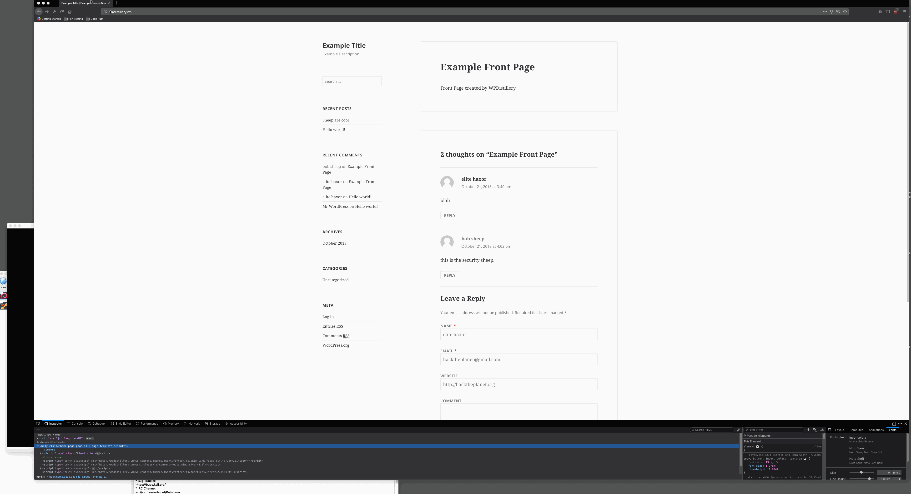
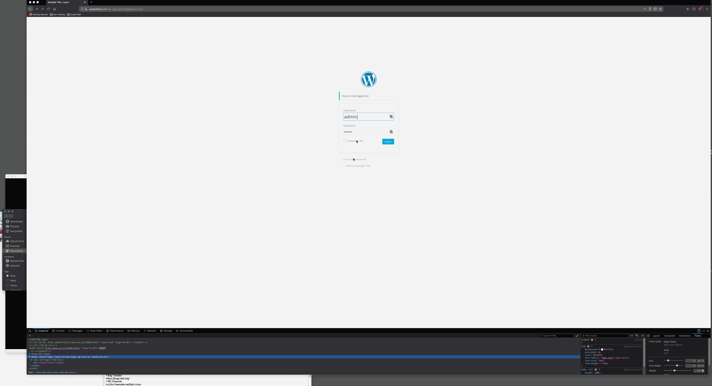
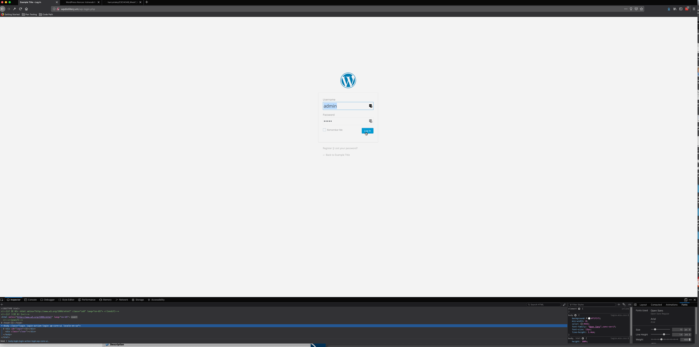

# Project 7 - WordPress Pentesting

Time spent: **12** hours spent in total

> Objective: Find, analyze, recreate, and document **five vulnerabilities** affecting an old version of WordPress

## Pentesting Report

1. WordPress <= 4.2 - Unauthenticated Stored Cross-Site Scripting (XSS)
  - [ ] Summary:
    - Vulnerability types: XSS
    - Tested in version: 4.2
    - Fixed in version: 4.2.1
    - [Exploit Database 36844](https://www.exploit-db.com/exploits/36844/)
    - [CVE 2015-3440](https://cve.mitre.org/cgi-bin/cvename.cgi?name=CVE-2015-3440)
  - [ ] GIF Walkthrough:
    
  - [ ] Steps to recreate:
    - login as administrator.
    - Find and comment on an existing post.
    - open [WP_<=_4.2_Unauthenticated_Stored_XSS.js](./code/WP_<=_4.2_Unauthenticated_Stored_XSS.js)
    - copy the text javascript.
    - navigate to your desired WP site.
    - create a new comment on a post and paste the javascript into the comment text.
    - Wait for an administrator to approve your comment.
    - Once done your javascript will execute on hover.
    - A more detailed explanation of this exploit can be had at the following ilnk. [Detailed Example Gist](https://gist.github.com/mrclay/aea4042f60999cfed51c)
  - [ ] Affected source code:
    - [wp-db.php](https://core.trac.wordpress.org/browser/tags/4.2/src/wp-includes/wp-db.php)

2. Username Enumeration Provided via HTTP GET Request for using author id.
  - [ ] Summary: 
    - Vulnerability types: User Enumeration
    - Tested in version: 4.2
    - Fixed in version: N/A
    - [Blog Post Documenting Vulnerability](https://perishablepress.com/stop-user-enumeration-wordpress/)
  - [ ] GIF Walkthrough:
    
  - [ ] Steps to recreate:
    In this exploit we will gather information about the user ids avaialble via the author interface.
    1. in your browser enter ```http://wpdistillery.com?author=<author id>``` and insert a number for one of the authors.
      in our case we wil use ```http://wpdistillery.com?author=1```
    2. look at the redirected URL ```http://wpdistillery.vm/author/<user id>/ ```
      in our sample case we will be redirected to ```http://wpdistillery.vm/author/admin/``` where admin is our returned user name.
  - [ ] Affected source code:
    See the link to a possible fix [ahmed elhady's blog](https://medium.com/@ahmed_elhady/wordpress-username-enumeration-techniques-2ca0510df632)

3. User Enumeration Provided via Login Error Messages
  - [ ] Summary: 
    - Vulnerability types: User Enumeration
    - Tested in version: 4.2
    - Fixed in version: N/A
    - [CVE 2009-2335](https://cve.mitre.org/cgi-bin/cvename.cgi?name=CVE-2009-2335)
  - [ ] GIF Walkthrough:
    
  - [ ] Steps to recreate:
    1. In the username field type a known username.
    2. In the password field try to guess the password.
    3. You will see a message confirming the username.
    4. Try this same with a user that is known to not exist and youw ill get a different error message.
  - [ ] Affected source code:
    See the link to a possible fix [ahmed elhady's blog](https://medium.com/@ahmed_elhady/wordpress-username-enumeration-techniques-2ca0510df632)

4. Directory Traversal and Informaiton Exposure
  - [ ] Summary: 
    - Vulnerability types: Information Overexposure
    - Tested in version: 4.2
    - [CVE 548](https://cwe.mitre.org/data/definitions/548.html)
    - Fixed in version: unknown
  - [ ] GIF Walkthrough:
    
  - [ ] Steps to recreate:
    1. navigate to [/wp-admin/css](http://wpdistillery/wp-admin/css) or [/wp-admin/js](http://wpdistillery.vm/wp-admin/js/)
    2. Take a look at all of the files available to you.
  - [ ] Affected source code:
    N/A

5. Delete Plugin Path Traversal/Arbitrary File Deletion
  - [ ] Summary: 
    - Vulnerability types: Information Overexposure
    - Tested in version: 4.2
    - Fixed in version: unknown
    - This vulnerability should be fixed because it allows you to arbritrarially delete files through a get request.
    - This to my research has not been fixed. Some might say that this s not a vulnerability, but the person who is the Wordpress Admin may not be a system administrator and thus the user should be protected from inadvertant deletion.
    - [Proof of Concept Confirmed](https://www.homelab.it/index.php/2014/08/06/wordpress-3-4-vulnerabilities/)
    - [CVE 548](https://cwe.mitre.org/data/definitions/548.html)
  - [ ] GIF Walkthrough:
    
  - [ ] Steps to recreate: 
    1. Log in as Administrator
    2. Click on plugins
    3. Click Delete on your desired plugin.
    4. Click link ```Click to view entire list of files to be deleted```
    5. click the link again to close the list.
    6. In the address bar look at the address ```http://wpdistillery.vm/wp-admin/plugins.php?action=delete-selected&checked%5B0%5D=<FILES HERE>&plugin_status=all&paged=1&s&_wpnonce=25c604f1f7```
    7. Replace the text located at ```<FILES HERE>``` with whatever you wish to navigate to.
    8. For our example lets replace it with ```./../../../```
    9. You will now see other files.
    10. you can click delete to delete files other than those you intend to delete for the given plugin.
  - [ ] Affected source code:
    - [plugins.php](https://core.trac.wordpress.org/browser/branches/4.2/src/wp-admin/plugins.php)

## Assets

  ```WP_<=_4.2_Unauthenticated_Stored_XSS.js```

## Resources

- [WordPress Source Browser](https://core.trac.wordpress.org/browser/)
- [WordPress Developer Reference](https://developer.wordpress.org/reference/)

GIFs created with [LiceCap](http://www.cockos.com/licecap/).

## Notes

LiceCap initially did not capture anything but a black screen on Mac OSX 10.14 Mojave when I was using an external monitor, but I restarted my computer and it worked.
I also initially had some trouble finding the hover target due to screen magnification issues for the first pentest which is why the video went kind of longer, but I ended up demonstrating it without any issues.
I spent a great deal of time researching ways to execute additional vulnerabilities not listed in WPScan.
All vulnerabilites were executed on WP Core. I was also looking at SQL injection vulnerabilities, but the ones that I have found seemed to be very severe, but there also seem to be a glut of XSS attacks.
Attack number five could be executed using a XSS from attack one combined with attack five.

## Reconnicence

### NMAP

command
```bash
nmap -p- 192.168.33.10
```
output
```
Starting Nmap 7.70 ( https://nmap.org ) at 2018-10-22 08:28 EDT
Nmap scan report for wpdistillery.vm (192.168.33.10)
Host is up (0.10s latency).
Not shown: 65531 closed ports
PORT     STATE SERVICE
22/tcp   open  ssh
80/tcp   open  http
1025/tcp open  NFS-or-IIS
8025/tcp open  ca-audit-da

Nmap done: 1 IP address (1 host up) scanned
```

### WPSCAN

Command
```bash
wpscan --url http://wpdistillery.vm --random-agent
```
Output
```
[+] URL: http://wpdistillery.vm/
[+] Started: Sat Oct 20 01:18:12 2018

[+] Interesting header: LINK: <http://wpdistillery.vm/>; rel=shortlink
[+] Interesting header: SERVER: Apache/2.4.18 (Ubuntu)
[+] XML-RPC Interface available under: http://wpdistillery.vm/xmlrpc.php   [HTTP 405]
[+] Found an RSS Feed: http://wpdistillery.vm/feed/   [HTTP 404]
[!] Full Path Disclosure (FPD) in 'http://wpdistillery.vm/wp-includes/rss-functions.php': 
[!] Upload directory has directory listing enabled: http://wpdistillery.vm/wp-content/uploads/
[!] Includes directory has directory listing enabled: http://wpdistillery.vm/wp-includes/

[+] Enumerating WordPress version ...
[!] The WordPress 'http://wpdistillery.vm/readme.html' file exists exposing a version number

[+] WordPress version 4.2 (Released on 2015-04-23) identified from advanced fingerprinting, meta generator, readme, links opml, stylesheets numbers
[!] 56 vulnerabilities identified from the version number

[!] Title: WordPress <= 4.2 - Unauthenticated Stored Cross-Site Scripting (XSS)
    Reference: https://wpvulndb.com/vulnerabilities/7945
    Reference: http://klikki.fi/adv/wordpress2.html
    Reference: http://packetstormsecurity.com/files/131644/
    Reference: https://www.exploit-db.com/exploits/36844/
[i] Fixed in: 4.2.1

[!] Title: WordPress 4.1-4.2.1 - Unauthenticated Genericons Cross-Site Scripting (XSS)
    Reference: https://wpvulndb.com/vulnerabilities/7979
    Reference: https://codex.wordpress.org/Version_4.2.2
[i] Fixed in: 4.2.2

[!] Title: WordPress <= 4.2.2 - Authenticated Stored Cross-Site Scripting (XSS)
    Reference: https://wpvulndb.com/vulnerabilities/8111
    Reference: https://wordpress.org/news/2015/07/wordpress-4-2-3/
    Reference: https://twitter.com/klikkioy/status/624264122570526720
    Reference: https://klikki.fi/adv/wordpress3.html
    Reference: https://cve.mitre.org/cgi-bin/cvename.cgi?name=CVE-2015-5622
    Reference: https://cve.mitre.org/cgi-bin/cvename.cgi?name=CVE-2015-5623
[i] Fixed in: 4.2.3

[!] Title: WordPress <= 4.2.3 - wp_untrash_post_comments SQL Injection 
    Reference: https://wpvulndb.com/vulnerabilities/8126
    Reference: https://github.com/WordPress/WordPress/commit/70128fe7605cb963a46815cf91b0a5934f70eff5
    Reference: https://cve.mitre.org/cgi-bin/cvename.cgi?name=CVE-2015-2213
[i] Fixed in: 4.2.4

[!] Title: WordPress <= 4.2.3 - Timing Side Channel Attack
    Reference: https://wpvulndb.com/vulnerabilities/8130
    Reference: https://core.trac.wordpress.org/changeset/33536
    Reference: https://cve.mitre.org/cgi-bin/cvename.cgi?name=CVE-2015-5730
[i] Fixed in: 4.2.4

[!] Title: WordPress <= 4.2.3 - Widgets Title Cross-Site Scripting (XSS)
    Reference: https://wpvulndb.com/vulnerabilities/8131
    Reference: https://core.trac.wordpress.org/changeset/33529
    Reference: https://cve.mitre.org/cgi-bin/cvename.cgi?name=CVE-2015-5732
[i] Fixed in: 4.2.4

[!] Title: WordPress <= 4.2.3 - Nav Menu Title Cross-Site Scripting (XSS)
    Reference: https://wpvulndb.com/vulnerabilities/8132
    Reference: https://core.trac.wordpress.org/changeset/33541
    Reference: https://cve.mitre.org/cgi-bin/cvename.cgi?name=CVE-2015-5733
[i] Fixed in: 4.2.4

[!] Title: WordPress <= 4.2.3 - Legacy Theme Preview Cross-Site Scripting (XSS)
    Reference: https://wpvulndb.com/vulnerabilities/8133
    Reference: https://core.trac.wordpress.org/changeset/33549
    Reference: https://blog.sucuri.net/2015/08/persistent-xss-vulnerability-in-wordpress-explained.html
    Reference: https://cve.mitre.org/cgi-bin/cvename.cgi?name=CVE-2015-5734
[i] Fixed in: 4.2.4

[!] Title: WordPress <= 4.3 - Authenticated Shortcode Tags Cross-Site Scripting (XSS)
    Reference: https://wpvulndb.com/vulnerabilities/8186
    Reference: https://wordpress.org/news/2015/09/wordpress-4-3-1/
    Reference: http://blog.checkpoint.com/2015/09/15/finding-vulnerabilities-in-core-wordpress-a-bug-hunters-trilogy-part-iii-ultimatum/
    Reference: http://blog.knownsec.com/2015/09/wordpress-vulnerability-analysis-cve-2015-5714-cve-2015-5715/
    Reference: https://cve.mitre.org/cgi-bin/cvename.cgi?name=CVE-2015-5714
[i] Fixed in: 4.2.5

[!] Title: WordPress <= 4.3 - User List Table Cross-Site Scripting (XSS)
    Reference: https://wpvulndb.com/vulnerabilities/8187
    Reference: https://wordpress.org/news/2015/09/wordpress-4-3-1/
    Reference: https://github.com/WordPress/WordPress/commit/f91a5fd10ea7245e5b41e288624819a37adf290a
    Reference: https://cve.mitre.org/cgi-bin/cvename.cgi?name=CVE-2015-7989
[i] Fixed in: 4.2.5

[!] Title: WordPress <= 4.3 - Publish Post & Mark as Sticky Permission Issue
    Reference: https://wpvulndb.com/vulnerabilities/8188
    Reference: https://wordpress.org/news/2015/09/wordpress-4-3-1/
    Reference: http://blog.checkpoint.com/2015/09/15/finding-vulnerabilities-in-core-wordpress-a-bug-hunters-trilogy-part-iii-ultimatum/
    Reference: http://blog.knownsec.com/2015/09/wordpress-vulnerability-analysis-cve-2015-5714-cve-2015-5715/
    Reference: https://cve.mitre.org/cgi-bin/cvename.cgi?name=CVE-2015-5715
[i] Fixed in: 4.2.5

[!] Title: WordPress  3.7-4.4 - Authenticated Cross-Site Scripting (XSS)
    Reference: https://wpvulndb.com/vulnerabilities/8358
    Reference: https://wordpress.org/news/2016/01/wordpress-4-4-1-security-and-maintenance-release/
    Reference: https://github.com/WordPress/WordPress/commit/7ab65139c6838910426567849c7abed723932b87
    Reference: https://cve.mitre.org/cgi-bin/cvename.cgi?name=CVE-2016-1564
[i] Fixed in: 4.2.6

[!] Title: WordPress 3.7-4.4.1 - Local URIs Server Side Request Forgery (SSRF)
    Reference: https://wpvulndb.com/vulnerabilities/8376
    Reference: https://wordpress.org/news/2016/02/wordpress-4-4-2-security-and-maintenance-release/
    Reference: https://core.trac.wordpress.org/changeset/36435
    Reference: https://hackerone.com/reports/110801
    Reference: https://cve.mitre.org/cgi-bin/cvename.cgi?name=CVE-2016-2222
[i] Fixed in: 4.2.7

[!] Title: WordPress 3.7-4.4.1 - Open Redirect
    Reference: https://wpvulndb.com/vulnerabilities/8377
    Reference: https://wordpress.org/news/2016/02/wordpress-4-4-2-security-and-maintenance-release/
    Reference: https://core.trac.wordpress.org/changeset/36444
    Reference: https://cve.mitre.org/cgi-bin/cvename.cgi?name=CVE-2016-2221
[i] Fixed in: 4.2.7

[!] Title: WordPress <= 4.4.2 - SSRF Bypass using Octal & Hexedecimal IP addresses
    Reference: https://wpvulndb.com/vulnerabilities/8473
    Reference: https://codex.wordpress.org/Version_4.5
    Reference: https://github.com/WordPress/WordPress/commit/af9f0520875eda686fd13a427fd3914d7aded049
    Reference: https://cve.mitre.org/cgi-bin/cvename.cgi?name=CVE-2016-4029
[i] Fixed in: 4.5

[!] Title: WordPress <= 4.4.2 - Reflected XSS in Network Settings
    Reference: https://wpvulndb.com/vulnerabilities/8474
    Reference: https://codex.wordpress.org/Version_4.5
    Reference: https://github.com/WordPress/WordPress/commit/cb2b3ed3c7d68f6505bfb5c90257e6aaa3e5fcb9
    Reference: https://cve.mitre.org/cgi-bin/cvename.cgi?name=CVE-2016-6634
[i] Fixed in: 4.5

[!] Title: WordPress <= 4.4.2 - Script Compression Option CSRF
    Reference: https://wpvulndb.com/vulnerabilities/8475
    Reference: https://codex.wordpress.org/Version_4.5
    Reference: https://cve.mitre.org/cgi-bin/cvename.cgi?name=CVE-2016-6635
[i] Fixed in: 4.5

[!] Title: WordPress 4.2-4.5.1 - MediaElement.js Reflected Cross-Site Scripting (XSS)
    Reference: https://wpvulndb.com/vulnerabilities/8488
    Reference: https://wordpress.org/news/2016/05/wordpress-4-5-2/
    Reference: https://github.com/WordPress/WordPress/commit/a493dc0ab5819c8b831173185f1334b7c3e02e36
    Reference: https://gist.github.com/cure53/df34ea68c26441f3ae98f821ba1feb9c
    Reference: https://cve.mitre.org/cgi-bin/cvename.cgi?name=CVE-2016-4567
[i] Fixed in: 4.5.2

[!] Title: WordPress <= 4.5.1 - Pupload Same Origin Method Execution (SOME)
    Reference: https://wpvulndb.com/vulnerabilities/8489
    Reference: https://wordpress.org/news/2016/05/wordpress-4-5-2/
    Reference: https://github.com/WordPress/WordPress/commit/c33e975f46a18f5ad611cf7e7c24398948cecef8
    Reference: https://gist.github.com/cure53/09a81530a44f6b8173f545accc9ed07e
    Reference: https://cve.mitre.org/cgi-bin/cvename.cgi?name=CVE-2016-4566
[i] Fixed in: 4.2.8

[!] Title: WordPress 4.2-4.5.2 - Authenticated Attachment Name Stored XSS
    Reference: https://wpvulndb.com/vulnerabilities/8518
    Reference: https://wordpress.org/news/2016/06/wordpress-4-5-3/
    Reference: https://github.com/WordPress/WordPress/commit/4372cdf45d0f49c74bbd4d60db7281de83e32648
    Reference: https://cve.mitre.org/cgi-bin/cvename.cgi?name=CVE-2016-5833
    Reference: https://cve.mitre.org/cgi-bin/cvename.cgi?name=CVE-2016-5834
[i] Fixed in: 4.2.9

[!] Title: WordPress 3.6-4.5.2 - Authenticated Revision History Information Disclosure
    Reference: https://wpvulndb.com/vulnerabilities/8519
    Reference: https://wordpress.org/news/2016/06/wordpress-4-5-3/
    Reference: https://github.com/WordPress/WordPress/commit/a2904cc3092c391ac7027bc87f7806953d1a25a1
    Reference: https://www.wordfence.com/blog/2016/06/wordpress-core-vulnerability-bypass-password-protected-posts/
    Reference: https://cve.mitre.org/cgi-bin/cvename.cgi?name=CVE-2016-5835
[i] Fixed in: 4.2.9

[!] Title: WordPress 2.6.0-4.5.2 - Unauthorized Category Removal from Post
    Reference: https://wpvulndb.com/vulnerabilities/8520
    Reference: https://wordpress.org/news/2016/06/wordpress-4-5-3/
    Reference: https://github.com/WordPress/WordPress/commit/6d05c7521baa980c4efec411feca5e7fab6f307c
    Reference: https://cve.mitre.org/cgi-bin/cvename.cgi?name=CVE-2016-5837
[i] Fixed in: 4.2.9

[!] Title: WordPress 2.5-4.6 - Authenticated Stored Cross-Site Scripting via Image Filename
    Reference: https://wpvulndb.com/vulnerabilities/8615
    Reference: https://wordpress.org/news/2016/09/wordpress-4-6-1-security-and-maintenance-release/
    Reference: https://github.com/WordPress/WordPress/commit/c9e60dab176635d4bfaaf431c0ea891e4726d6e0
    Reference: https://sumofpwn.nl/advisory/2016/persistent_cross_site_scripting_vulnerability_in_wordpress_due_to_unsafe_processing_of_file_names.html
    Reference: http://seclists.org/fulldisclosure/2016/Sep/6
    Reference: https://cve.mitre.org/cgi-bin/cvename.cgi?name=CVE-2016-7168
[i] Fixed in: 4.2.10

[!] Title: WordPress 2.8-4.6 - Path Traversal in Upgrade Package Uploader
    Reference: https://wpvulndb.com/vulnerabilities/8616
    Reference: https://wordpress.org/news/2016/09/wordpress-4-6-1-security-and-maintenance-release/
    Reference: https://github.com/WordPress/WordPress/commit/54720a14d85bc1197ded7cb09bd3ea790caa0b6e
    Reference: https://cve.mitre.org/cgi-bin/cvename.cgi?name=CVE-2016-7169
[i] Fixed in: 4.2.10

[!] Title: WordPress 2.9-4.7 - Authenticated Cross-Site scripting (XSS) in update-core.php
    Reference: https://wpvulndb.com/vulnerabilities/8716
    Reference: https://github.com/WordPress/WordPress/blob/c9ea1de1441bb3bda133bf72d513ca9de66566c2/wp-admin/update-core.php
    Reference: https://wordpress.org/news/2017/01/wordpress-4-7-1-security-and-maintenance-release/
    Reference: https://cve.mitre.org/cgi-bin/cvename.cgi?name=CVE-2017-5488
[i] Fixed in: 4.2.11

[!] Title: WordPress 3.4-4.7 - Stored Cross-Site Scripting (XSS) via Theme Name fallback
    Reference: https://wpvulndb.com/vulnerabilities/8718
    Reference: https://www.mehmetince.net/low-severity-wordpress/
    Reference: https://wordpress.org/news/2017/01/wordpress-4-7-1-security-and-maintenance-release/
    Reference: https://github.com/WordPress/WordPress/commit/ce7fb2934dd111e6353784852de8aea2a938b359
    Reference: https://cve.mitre.org/cgi-bin/cvename.cgi?name=CVE-2017-5490
[i] Fixed in: 4.2.11

[!] Title: WordPress <= 4.7 - Post via Email Checks mail.example.com by Default
    Reference: https://wpvulndb.com/vulnerabilities/8719
    Reference: https://github.com/WordPress/WordPress/commit/061e8788814ac87706d8b95688df276fe3c8596a
    Reference: https://wordpress.org/news/2017/01/wordpress-4-7-1-security-and-maintenance-release/
    Reference: https://cve.mitre.org/cgi-bin/cvename.cgi?name=CVE-2017-5491
[i] Fixed in: 4.2.11

[!] Title: WordPress 2.8-4.7 - Accessibility Mode Cross-Site Request Forgery (CSRF)
    Reference: https://wpvulndb.com/vulnerabilities/8720
    Reference: https://github.com/WordPress/WordPress/commit/03e5c0314aeffe6b27f4b98fef842bf0fb00c733
    Reference: https://wordpress.org/news/2017/01/wordpress-4-7-1-security-and-maintenance-release/
    Reference: https://cve.mitre.org/cgi-bin/cvename.cgi?name=CVE-2017-5492
[i] Fixed in: 4.2.11

[!] Title: WordPress 3.0-4.7 - Cryptographically Weak Pseudo-Random Number Generator (PRNG)
    Reference: https://wpvulndb.com/vulnerabilities/8721
    Reference: https://github.com/WordPress/WordPress/commit/cea9e2dc62abf777e06b12ec4ad9d1aaa49b29f4
    Reference: https://wordpress.org/news/2017/01/wordpress-4-7-1-security-and-maintenance-release/
    Reference: https://cve.mitre.org/cgi-bin/cvename.cgi?name=CVE-2017-5493
[i] Fixed in: 4.2.11

[!] Title: WordPress 4.2.0-4.7.1 - Press This UI Available to Unauthorised Users
    Reference: https://wpvulndb.com/vulnerabilities/8729
    Reference: https://wordpress.org/news/2017/01/wordpress-4-7-2-security-release/
    Reference: https://github.com/WordPress/WordPress/commit/21264a31e0849e6ff793a06a17de877dd88ea454
    Reference: https://cve.mitre.org/cgi-bin/cvename.cgi?name=CVE-2017-5610
[i] Fixed in: 4.2.12

[!] Title: WordPress 3.5-4.7.1 - WP_Query SQL Injection
    Reference: https://wpvulndb.com/vulnerabilities/8730
    Reference: https://wordpress.org/news/2017/01/wordpress-4-7-2-security-release/
    Reference: https://github.com/WordPress/WordPress/commit/85384297a60900004e27e417eac56d24267054cb
    Reference: https://cve.mitre.org/cgi-bin/cvename.cgi?name=CVE-2017-5611
[i] Fixed in: 4.2.12

[!] Title: WordPress 3.6.0-4.7.2 - Authenticated Cross-Site Scripting (XSS) via Media File Metadata
    Reference: https://wpvulndb.com/vulnerabilities/8765
    Reference: https://wordpress.org/news/2017/03/wordpress-4-7-3-security-and-maintenance-release/
    Reference: https://github.com/WordPress/WordPress/commit/28f838ca3ee205b6f39cd2bf23eb4e5f52796bd7
    Reference: https://sumofpwn.nl/advisory/2016/wordpress_audio_playlist_functionality_is_affected_by_cross_site_scripting.html
    Reference: http://seclists.org/oss-sec/2017/q1/563
    Reference: https://cve.mitre.org/cgi-bin/cvename.cgi?name=CVE-2017-6814
[i] Fixed in: 4.2.13

[!] Title: WordPress 2.8.1-4.7.2 - Control Characters in Redirect URL Validation
    Reference: https://wpvulndb.com/vulnerabilities/8766
    Reference: https://wordpress.org/news/2017/03/wordpress-4-7-3-security-and-maintenance-release/
    Reference: https://github.com/WordPress/WordPress/commit/288cd469396cfe7055972b457eb589cea51ce40e
    Reference: https://cve.mitre.org/cgi-bin/cvename.cgi?name=CVE-2017-6815
[i] Fixed in: 4.2.13

[!] Title: WordPress  4.0-4.7.2 - Authenticated Stored Cross-Site Scripting (XSS) in YouTube URL Embeds
    Reference: https://wpvulndb.com/vulnerabilities/8768
    Reference: https://wordpress.org/news/2017/03/wordpress-4-7-3-security-and-maintenance-release/
    Reference: https://github.com/WordPress/WordPress/commit/419c8d97ce8df7d5004ee0b566bc5e095f0a6ca8
    Reference: https://blog.sucuri.net/2017/03/stored-xss-in-wordpress-core.html
    Reference: https://cve.mitre.org/cgi-bin/cvename.cgi?name=CVE-2017-6817
[i] Fixed in: 4.2.13

[!] Title: WordPress 4.2-4.7.2 - Press This CSRF DoS
    Reference: https://wpvulndb.com/vulnerabilities/8770
    Reference: https://wordpress.org/news/2017/03/wordpress-4-7-3-security-and-maintenance-release/
    Reference: https://github.com/WordPress/WordPress/commit/263831a72d08556bc2f3a328673d95301a152829
    Reference: https://sumofpwn.nl/advisory/2016/cross_site_request_forgery_in_wordpress_press_this_function_allows_dos.html
    Reference: http://seclists.org/oss-sec/2017/q1/562
    Reference: https://hackerone.com/reports/153093
    Reference: https://cve.mitre.org/cgi-bin/cvename.cgi?name=CVE-2017-6819
[i] Fixed in: 4.2.13

[!] Title: WordPress 2.3-4.8.3 - Host Header Injection in Password Reset
    Reference: https://wpvulndb.com/vulnerabilities/8807
    Reference: https://exploitbox.io/vuln/WordPress-Exploit-4-7-Unauth-Password-Reset-0day-CVE-2017-8295.html
    Reference: http://blog.dewhurstsecurity.com/2017/05/04/exploitbox-wordpress-security-advisories.html
    Reference: https://core.trac.wordpress.org/ticket/25239
    Reference: https://cve.mitre.org/cgi-bin/cvename.cgi?name=CVE-2017-8295

[!] Title: WordPress 2.7.0-4.7.4 - Insufficient Redirect Validation
    Reference: https://wpvulndb.com/vulnerabilities/8815
    Reference: https://github.com/WordPress/WordPress/commit/76d77e927bb4d0f87c7262a50e28d84e01fd2b11
    Reference: https://wordpress.org/news/2017/05/wordpress-4-7-5/
    Reference: https://cve.mitre.org/cgi-bin/cvename.cgi?name=CVE-2017-9066
[i] Fixed in: 4.2.15

[!] Title: WordPress 2.5.0-4.7.4 - Post Meta Data Values Improper Handling in XML-RPC
    Reference: https://wpvulndb.com/vulnerabilities/8816
    Reference: https://wordpress.org/news/2017/05/wordpress-4-7-5/
    Reference: https://github.com/WordPress/WordPress/commit/3d95e3ae816f4d7c638f40d3e936a4be19724381
    Reference: https://cve.mitre.org/cgi-bin/cvename.cgi?name=CVE-2017-9062
[i] Fixed in: 4.2.15

[!] Title: WordPress 3.4.0-4.7.4 - XML-RPC Post Meta Data Lack of Capability Checks 
    Reference: https://wpvulndb.com/vulnerabilities/8817
    Reference: https://wordpress.org/news/2017/05/wordpress-4-7-5/
    Reference: https://github.com/WordPress/WordPress/commit/e88a48a066ab2200ce3091b131d43e2fab2460a4
    Reference: https://cve.mitre.org/cgi-bin/cvename.cgi?name=CVE-2017-9065
[i] Fixed in: 4.2.15

[!] Title: WordPress 2.5.0-4.7.4 - Filesystem Credentials Dialog CSRF
    Reference: https://wpvulndb.com/vulnerabilities/8818
    Reference: https://wordpress.org/news/2017/05/wordpress-4-7-5/
    Reference: https://github.com/WordPress/WordPress/commit/38347d7c580be4cdd8476e4bbc653d5c79ed9b67
    Reference: https://sumofpwn.nl/advisory/2016/cross_site_request_forgery_in_wordpress_connection_information.html
    Reference: https://cve.mitre.org/cgi-bin/cvename.cgi?name=CVE-2017-9064
[i] Fixed in: 4.2.15

[!] Title: WordPress 3.3-4.7.4 - Large File Upload Error XSS
    Reference: https://wpvulndb.com/vulnerabilities/8819
    Reference: https://wordpress.org/news/2017/05/wordpress-4-7-5/
    Reference: https://github.com/WordPress/WordPress/commit/8c7ea71edbbffca5d9766b7bea7c7f3722ffafa6
    Reference: https://hackerone.com/reports/203515
    Reference: https://hackerone.com/reports/203515
    Reference: https://cve.mitre.org/cgi-bin/cvename.cgi?name=CVE-2017-9061
[i] Fixed in: 4.2.15

[!] Title: WordPress 3.4.0-4.7.4 - Customizer XSS & CSRF
    Reference: https://wpvulndb.com/vulnerabilities/8820
    Reference: https://wordpress.org/news/2017/05/wordpress-4-7-5/
    Reference: https://github.com/WordPress/WordPress/commit/3d10fef22d788f29aed745b0f5ff6f6baea69af3
    Reference: https://cve.mitre.org/cgi-bin/cvename.cgi?name=CVE-2017-9063
[i] Fixed in: 4.2.15

[!] Title: WordPress 2.3.0-4.8.1 - $wpdb->prepare() potential SQL Injection
    Reference: https://wpvulndb.com/vulnerabilities/8905
    Reference: https://wordpress.org/news/2017/09/wordpress-4-8-2-security-and-maintenance-release/
    Reference: https://github.com/WordPress/WordPress/commit/70b21279098fc973eae803693c0705a548128e48
    Reference: https://github.com/WordPress/WordPress/commit/fc930d3daed1c3acef010d04acc2c5de93cd18ec
[i] Fixed in: 4.2.16

[!] Title: WordPress 2.3.0-4.7.4 - Authenticated SQL injection
    Reference: https://wpvulndb.com/vulnerabilities/8906
    Reference: https://medium.com/websec/wordpress-sqli-bbb2afcc8e94
    Reference: https://wordpress.org/news/2017/09/wordpress-4-8-2-security-and-maintenance-release/
    Reference: https://github.com/WordPress/WordPress/commit/70b21279098fc973eae803693c0705a548128e48
    Reference: https://wpvulndb.com/vulnerabilities/8905
[i] Fixed in: 4.7.5

[!] Title: WordPress 2.9.2-4.8.1 - Open Redirect
    Reference: https://wpvulndb.com/vulnerabilities/8910
    Reference: https://wordpress.org/news/2017/09/wordpress-4-8-2-security-and-maintenance-release/
    Reference: https://core.trac.wordpress.org/changeset/41398
    Reference: https://cve.mitre.org/cgi-bin/cvename.cgi?name=CVE-2017-14725
[i] Fixed in: 4.2.16

[!] Title: WordPress 3.0-4.8.1 - Path Traversal in Unzipping
    Reference: https://wpvulndb.com/vulnerabilities/8911
    Reference: https://wordpress.org/news/2017/09/wordpress-4-8-2-security-and-maintenance-release/
    Reference: https://core.trac.wordpress.org/changeset/41457
    Reference: https://cve.mitre.org/cgi-bin/cvename.cgi?name=CVE-2017-14719
[i] Fixed in: 4.2.16

[!] Title: WordPress <= 4.8.2 - $wpdb->prepare() Weakness
    Reference: https://wpvulndb.com/vulnerabilities/8941
    Reference: https://wordpress.org/news/2017/10/wordpress-4-8-3-security-release/
    Reference: https://github.com/WordPress/WordPress/commit/a2693fd8602e3263b5925b9d799ddd577202167d
    Reference: https://twitter.com/ircmaxell/status/923662170092638208
    Reference: https://blog.ircmaxell.com/2017/10/disclosure-wordpress-wpdb-sql-injection-technical.html
    Reference: https://cve.mitre.org/cgi-bin/cvename.cgi?name=CVE-2017-16510
[i] Fixed in: 4.2.17

[!] Title: WordPress 2.8.6-4.9 - Authenticated JavaScript File Upload
    Reference: https://wpvulndb.com/vulnerabilities/8966
    Reference: https://wordpress.org/news/2017/11/wordpress-4-9-1-security-and-maintenance-release/
    Reference: https://github.com/WordPress/WordPress/commit/67d03a98c2cae5f41843c897f206adde299b0509
    Reference: https://cve.mitre.org/cgi-bin/cvename.cgi?name=CVE-2017-17092
[i] Fixed in: 4.2.18

[!] Title: WordPress 1.5.0-4.9 - RSS and Atom Feed Escaping
    Reference: https://wpvulndb.com/vulnerabilities/8967
    Reference: https://wordpress.org/news/2017/11/wordpress-4-9-1-security-and-maintenance-release/
    Reference: https://github.com/WordPress/WordPress/commit/f1de7e42df29395c3314bf85bff3d1f4f90541de
    Reference: https://cve.mitre.org/cgi-bin/cvename.cgi?name=CVE-2017-17094
[i] Fixed in: 4.2.18

[!] Title: WordPress 3.7-4.9 - 'newbloguser' Key Weak Hashing
    Reference: https://wpvulndb.com/vulnerabilities/8969
    Reference: https://wordpress.org/news/2017/11/wordpress-4-9-1-security-and-maintenance-release/
    Reference: https://github.com/WordPress/WordPress/commit/eaf1cfdc1fe0bdffabd8d879c591b864d833326c
    Reference: https://cve.mitre.org/cgi-bin/cvename.cgi?name=CVE-2017-17091
[i] Fixed in: 4.2.18

[!] Title: WordPress 3.7-4.9.1 - MediaElement Cross-Site Scripting (XSS)
    Reference: https://wpvulndb.com/vulnerabilities/9006
    Reference: https://github.com/WordPress/WordPress/commit/3fe9cb61ee71fcfadb5e002399296fcc1198d850
    Reference: https://wordpress.org/news/2018/01/wordpress-4-9-2-security-and-maintenance-release/
    Reference: https://core.trac.wordpress.org/ticket/42720
    Reference: https://cve.mitre.org/cgi-bin/cvename.cgi?name=CVE-2018-5776
[i] Fixed in: 4.9.2

[!] Title: WordPress <= 4.9.4 - Application Denial of Service (DoS) (unpatched)
    Reference: https://wpvulndb.com/vulnerabilities/9021
    Reference: https://baraktawily.blogspot.fr/2018/02/how-to-dos-29-of-world-wide-websites.html
    Reference: https://github.com/quitten/doser.py
    Reference: https://thehackernews.com/2018/02/wordpress-dos-exploit.html
    Reference: https://cve.mitre.org/cgi-bin/cvename.cgi?name=CVE-2018-6389

[!] Title: WordPress 3.7-4.9.4 - Remove localhost Default
    Reference: https://wpvulndb.com/vulnerabilities/9053
    Reference: https://wordpress.org/news/2018/04/wordpress-4-9-5-security-and-maintenance-release/
    Reference: https://github.com/WordPress/WordPress/commit/804363859602d4050d9a38a21f5a65d9aec18216
    Reference: https://cve.mitre.org/cgi-bin/cvename.cgi?name=CVE-2018-10101
[i] Fixed in: 4.2.20

[!] Title: WordPress 3.7-4.9.4 - Use Safe Redirect for Login
    Reference: https://wpvulndb.com/vulnerabilities/9054
    Reference: https://wordpress.org/news/2018/04/wordpress-4-9-5-security-and-maintenance-release/
    Reference: https://github.com/WordPress/WordPress/commit/14bc2c0a6fde0da04b47130707e01df850eedc7e
    Reference: https://cve.mitre.org/cgi-bin/cvename.cgi?name=CVE-2018-10100
[i] Fixed in: 4.2.20

[!] Title: WordPress 3.7-4.9.4 - Escape Version in Generator Tag
    Reference: https://wpvulndb.com/vulnerabilities/9055
    Reference: https://wordpress.org/news/2018/04/wordpress-4-9-5-security-and-maintenance-release/
    Reference: https://github.com/WordPress/WordPress/commit/31a4369366d6b8ce30045d4c838de2412c77850d
    Reference: https://cve.mitre.org/cgi-bin/cvename.cgi?name=CVE-2018-10102
[i] Fixed in: 4.2.20

[!] Title: WordPress <= 4.9.6 - Authenticated Arbitrary File Deletion
    Reference: https://wpvulndb.com/vulnerabilities/9100
    Reference: https://blog.ripstech.com/2018/wordpress-file-delete-to-code-execution/
    Reference: http://blog.vulnspy.com/2018/06/27/Wordpress-4-9-6-Arbitrary-File-Delection-Vulnerbility-Exploit/
    Reference: https://github.com/WordPress/WordPress/commit/c9dce0606b0d7e6f494d4abe7b193ac046a322cd
    Reference: https://wordpress.org/news/2018/07/wordpress-4-9-7-security-and-maintenance-release/
    Reference: https://www.wordfence.com/blog/2018/07/details-of-an-additional-file-deletion-vulnerability-patched-in-wordpress-4-9-7/
    Reference: https://cve.mitre.org/cgi-bin/cvename.cgi?name=CVE-2018-12895
[i] Fixed in: 4.2.21

[+] WordPress theme in use: twentyfifteen - v1.1

[+] Name: twentyfifteen - v1.1
 |  Last updated: 2018-05-17T00:00:00.000Z
 |  Location: http://wpdistillery.vm/wp-content/themes/twentyfifteen/
 |  Readme: http://wpdistillery.vm/wp-content/themes/twentyfifteen/readme.txt
[!] The version is out of date, the latest version is 2.0
 |  Style URL: http://wpdistillery.vm/wp-content/themes/twentyfifteen/style.css
 |  Theme Name: Twenty Fifteen
 |  Theme URI: https://wordpress.org/themes/twentyfifteen/
 |  Description: Our 2015 default theme is clean, blog-focused, and designed for clarity. Twenty Fifteen's simple,...
 |  Author: the WordPress team
 |  Author URI: https://wordpress.org/

[!] Title: Twenty Fifteen Theme <= 1.1 - DOM Cross-Site Scripting (XSS)
    Reference: https://wpvulndb.com/vulnerabilities/7965
    Reference: https://blog.sucuri.net/2015/05/jetpack-and-twentyfifteen-vulnerable-to-dom-based-xss-millions-of-wordpress-websites-affected-millions-of-wordpress-websites-affected.html
    Reference: http://packetstormsecurity.com/files/131802/
    Reference: http://seclists.org/fulldisclosure/2015/May/41
    Reference: https://cve.mitre.org/cgi-bin/cvename.cgi?name=CVE-2015-3429
[i] Fixed in: 1.2

[+] Enumerating plugins from passive detection ...
[+] No plugins found passively

[+] Finished: Sat Oct 20 01:18:17 2018
[+] Elapsed time: 00:00:04
[+] Requests made: 64
[+] Memory used: 43.078 MB
```


## License

    Copyright [2018] [Harry Staley]

    Licensed under the Apache License, Version 2.0 (the "License");
    you may not use this file except in compliance with the License.
    You may obtain a copy of the License at

        http://www.apache.org/licenses/LICENSE-2.0

    Unless required by applicable law or agreed to in writing, software
    distributed under the License is distributed on an "AS IS" BASIS,
    WITHOUT WARRANTIES OR CONDITIONS OF ANY KIND, either express or implied.
    See the License for the specific language governing permissions and
    limitations under the License.
